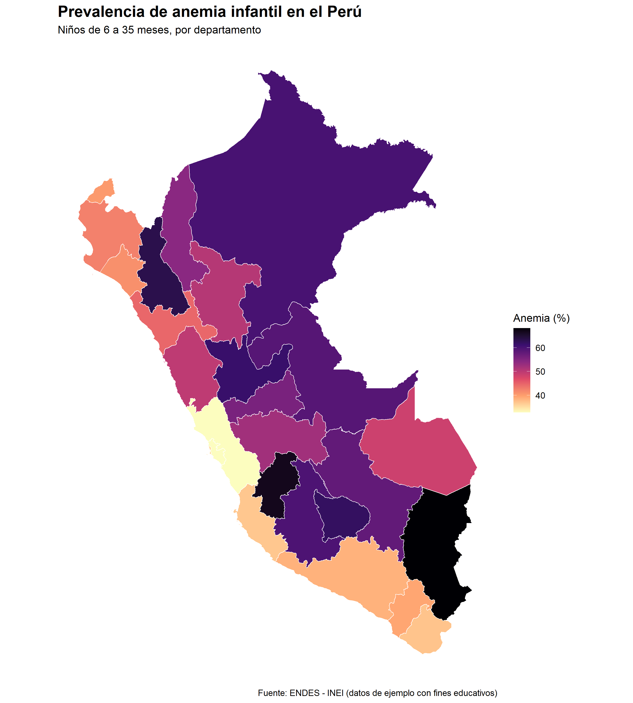

# Mapa de calor de anemia infantil en el Perú

Este proyecto presenta un mapa de calor de la prevalencia de anemia infantil en el Perú por departamento, usando R y datos estructurados en formato CSV.

El objetivo es mostrar cómo integrar datos de salud pública con información geográfica para construir una visualización territorial clara, reproducible y útil para análisis exploratorio.

## Resultado final



## Contexto

La anemia infantil es uno de los principales problemas de salud pública en el Perú. Su distribución territorial no es homogénea, por lo que un mapa departamental permite identificar zonas con mayor prevalencia y comunicar brechas regionales de forma visual.

Este tutorial se enfoca en niños de 6 a 35 meses, una población frecuentemente usada en reportes de anemia infantil.

## Datos utilizados

El proyecto usa dos componentes:

1. Un archivo CSV con la prevalencia de anemia infantil por departamento.
2. Límites geográficos departamentales del Perú descargados automáticamente desde R usando el paquete `geodata`.

El archivo principal de datos es:

```text
data/anemia_peru.csv
```

Estructura del CSV:

```text
departamento,anemia_pct
Amazonas,54.2
Ancash,49.8
Apurimac,62.1
...
```
> Nota: los datos incluidos en este repositorio son datos de ejemplo con fines educativos. Para un análisis oficial, deben reemplazarse por estimaciones provenientes de ENDES/INEI.

## Metodología

El flujo del análisis fue:

1. Importar el dataset de anemia infantil.
2. Descargar los límites departamentales del Perú.
3. Estandarizar nombres de departamentos para realizar la unión de datos.
4. Unir la tabla de anemia con el shapefile.
5. Construir el mapa de calor usando `ggplot2`.
6. Exportar el mapa final como imagen PNG.

## Paquetes utilizados

Este proyecto utiliza los siguientes paquetes de R:

```text
sf
terra
geodata
dplyr
ggplot2
readr
stringi
viridis
```

Puedes instalarlos con:

```r
install.packages(c(
  "sf",
  "terra",
  "geodata",
  "dplyr",
  "ggplot2",
  "readr",
  "stringi",
  "viridis"
))
```

## Cómo reproducir el proyecto

1. Clona o descarga este repositorio.
2. Abre el archivo `Mapa_de_calor_Anemia_Peru.qmd` en RStudio.
3. Verifica que el archivo `data/anemia_peru.csv` exista.
4. Ejecuta o renderiza el documento Quarto.
5. El mapa final se guardará en:

```text
output/mapa_anemia_peru.png
```

## Estructura del repositorio

```text
mapa-anemia-peru/
├── Mapa_de_calor_Anemia_Peru.qmd
├── Mapa_de_calor_Anemia_Peru.html
├── README.md
├── data/
│   ├── anemia_peru.csv
│   └── shapefiles/
└── output/
    └── mapa_anemia_peru.png
```

## Interpretación

Los departamentos con colores más intensos presentan una mayor prevalencia estimada de anemia infantil. Esta visualización permite identificar patrones territoriales y sirve como punto de partida para discutir desigualdades regionales en salud pública.

## Limitaciones

Este proyecto usa datos de ejemplo para demostrar el flujo técnico de trabajo. Por ello, el mapa no debe interpretarse como una estimación oficial actual de anemia infantil en el Perú.

Para un análisis oficial, se recomienda reemplazar el CSV por datos procesados directamente desde ENDES/INEI, idealmente aplicando pesos muestrales y criterios epidemiológicos adecuados.

## Autor

Adrian Tatsuo Yamaguchi Mongrut<br> 
Estudiante de Bioingeniería